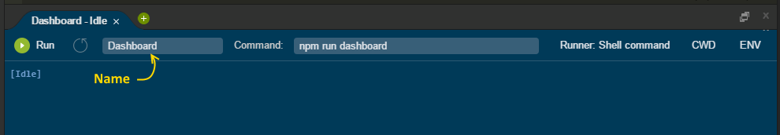

# Parse, Heroku and Foundation on Cloud9

This is fork of [Todd Heslin's](https://github.com/toddheslin) [Parse Heroku and Foundation project](https://github.com/toddheslin/parse-heroku-foundation/blob/master/README.md) that has been tweaked to play nicely with [Cloud9 IDE](https://c9.io/).

For more information on what Todd's project is and how to set it up, see the [README file](https://github.com/toddheslin/parse-heroku-foundation/blob/master/README.md).

# Set Up

## First Steps

Open a new terminal and type the following at the prompt:

    $ npm install

This might take some time.

## Parse Dashboard

To get the Parse Dashboard up and running, edit the `dashboard.config.json` file and add in the correct information for your app.

You will need to add in the appropriate `appId` and `masterKey` from Parse. Also update the Heroku and Cloud9 `serverURL` properties, replacing the app name and username as appropriate.

You can also change the username and password if you want.

Once this is done, go to **Cloud 9** &gt; **Preferences** &gt; **Project Settings** &gt; **Run Configurations**. Click _Add New Config_ button and enter the following details at the bottom of the screen.

| Setting Name | Value               |
| ------------ |---------------------|
| **Name**     | Dashboard           |
| **Command**  | `npm run dashboard` |
| **CWD**      | /                   |
| **Debug**    | &lt;empty&gt;       |
| **Runner**   | Shell command       |
| **Default**  | &lt;empty&gt;       |
| **ENV**      | &lt;empty&gt;       |

Click _Run_ and go to both URLs to test. You will need to log in with the username and password provided in the Dashboard config file.

